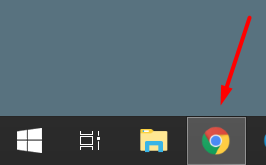

# A bot that transfers all music from Yandex.Music to VK
This crazy bot will help you transfer all your favorite music from Yandex.Music to VK :D

## Installation
1. Use the package manager [pip](https://pip.pypa.io/en/stable/) to install the necessary packages for [Python](https://www.python.org/downloads/) with `pip install -r requirements.txt --upgrade` (if you don't have one, it will be automatically installed)  
2. Then download or clone the repository to a place convenient for you. After, open 'bot.py' file with any text editor and write in your Yandex mail, password and the full link to your VK music into the relevant variables.

## Usage
Since the script doesn't use VK API to add tracks, the script adds tracks manually using the "pyautogui" package.

The easiest way to run a script is if your monitor has a resolution of 1920x1080 :)

All you need to do is:

1. Place the browser as shown in the picture:  

2. Open VK music in the browser and run the 'bot.py' script. Don't touch the mouse! Just watch.

If you don't have a Full HD monitor, you will need to change the coordinates in the script manually :(  
(or buy a Full HD monitor for this program :D)
